<p align ="center">

</p>


<div align="center">

[](https://pepy.tech/project/route0x)
[]()
[](https://opensource.org/licenses/MIT)
[](https://pypi.org/project/route0x/)
[](https://doi.org/10.5281/zenodo.11093524)

</div>

<hr>

<div align="center">

  <h4 align="center">
    <b>Low latency, High Accuracy, Custom Query routers for Humans and Agents </b>
    <br />
  </h4>
</div>

**Why Route0x?** Query Routing is a higher level tasks that neither dovetails into Intent classification nor into Query similarity, not atleast in isolation. The query `"How can I improve my credit score?"` is `In-Domain (ID)` but `Out-of-scope (OOS)` for a banking chatbot and `Out-Of-Domain (OOD) OOS` for a e-Commerce chatbot. A good query router should be able to learn to accept **ID In-Scope** queries and **Reject both ID OOS and OOD OOS**. Query routing cannot be just mapped to Intent classification alone and it won't work owing to the above requirements. Research literature hints Chatbots (or more formally) Task-Oriented Dialogue Systems (TODS) and Goal Oriented Dialogue Systems (GODS) have been grappling with this hard problem for a long time now. route0x is a humble attempt to tackle this issue and offer a production-grade solution for Humans and Agents.


**KPI for Query Routing:** $ / Query. (subsumes accuracy, latency)

> Hitherto, route0x is the `only (practically) free, low latency (no external I/O needed), DIY + Improvable, low shot (only 2 user samples per route/intent needed), production-grade solution, that is FT for only 100 steps` that matches or beats contemporay Query Routing Researches and Solutions. We tested it on `8 different TODS datasets (some are deployed systems) from different domains, granularity and complexity` against 2 different researches and 1 library.*

<br/>

| Dataset                   | Domain              | Has OOS? | Type                     | Test Size |
|---------------------------|---------------------|----------|--------------------------|-----------|
| Curekart                  | E-commerce         | Yes      | Real-world TODS queries  | 991       |
| Powerplay11               | Online Gaming      | Yes      | Real-world TODS queries  | 983       |
| Sofmattress               | Furniture          | Yes      | Real-world TODS queries  | 397       |
| CLINC150 OOS - Banking    | Banking            | Yes      | Expert / Synthetic       | 1850      |
| CLINC150 OOS - Credit Cards | Credit Cards     | Yes      | Expert / Synthetic       | 1850      |
| Banking 77                | Banking            | Yes      | Expert / Synthetic       | 4076      |
| ACID                      | Insurance          | No       | Real-world TODS queries  | 11042     |
| ROSTD                     | Personal Assistant | Yes      | Expert written           | 11711     |

<br/>

**Contributions**

1. Loss function - Variant of large scale angular margin loss .
2. Unsupervised OOS detection - novel combination. 
3. Uncertainity based fall-back mechanism - via NN.
4. Multi-vector (late interaction) reranking.

Ablations suggest each of these are required.

Check out the highlight reel of empirical evals and/or even dig deep with more numbers or get your hands-on with the starter notebook.

## Table of Contents

- [Route0x: Getting Started](#route0x-getting-started)
  - [Training](#training)
  - [Starter Notebook](#build-a-query-router-for-your-routes---starter-notebook)
  - [Inference](#inference)
  
- [Route0x Evals: A Highlight reel](#route0x-evals-a-highlight-reel)
  - [Route0x vs Amazon Research 2024: HINT3 OOS Dataset](#route0x-vs-amazon-research-2024-hint3-oos-dataset)
  - [Route0x vs Salesforce Research 2022: CLINC OOS Dataset](#route0x-vs-salesforce-research-2022-clinc-oos-dataset)
  - [Route0x vs Aurelio Labs' Semantic Router](#route0x-vs-aurelio-labs-semantic-router)

- [I want to know how it works](#i-want-to-know-how-it-works)

- [I want to understand the knobs and tinker with it](#i-want-to-understand-the-knobs-and-tinker-with-it)
  - [Key knobs for building](#key-knobs-for-building)
  - [Key knobs for routing](#key-knobs-for-routing)
  - [Full set of knobs for building](#full-set-of-knobs-for-building)
  - [Full set of knobs for routing](#full-set-of-knobs-for-routing)

- [I want to see more usage samples](#i-want-to-see-more-usage-samples)
- [I want to see the detailed numbers & reproduce benchmarks](#i-want-to-see-the-detailed-numbers--reproduce-benchmarks)

- [Features and Roadmap](#features-and-roadmap)

- [Caveats and Limitations](#caveats-and-limitations)

- [Citations](#citations)


## Route0x: Getting Started

We've disetangled the resource heavy route building (entails training) from query routing (entails inference)

### Training 
```python 
pip install route0x[build] # (*ML skills not needed)
```
### [Build a query router for your routes - Starter Notebook]()

### Inference 

```python 
pip install route0x[route] # (Light-weight without any heavy torch dependencies)
```

```python
from route0x.route_finder import RouteFinder
query_router = RouteFinder(<your_route0x_model_path>, use_calibrated_head=True)
route_obj = query_router.find_route(<your-query>)
```

## Route0x Evals: A Highlight reel.

### 1. [Route0x vs Amazon Research 2024: HINT3 OOS Dataset](https://arxiv.org/pdf/2410.01627)

**Goal of this comparison:** To show that Route0x offers:

- A better perf wrt  SetFit + NA or 
- A competitive perf wrt expensive & slow vanilla LLMs 
- A competitive perf wrt expensive & slow SetFit + NA + LLMs based approaches cited in the paper.

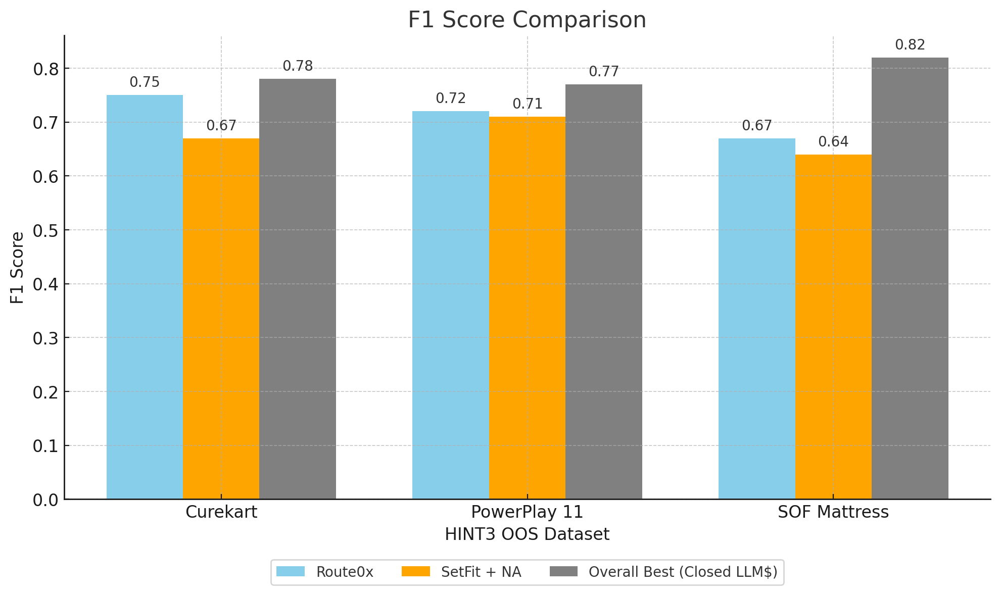<br/><br/>
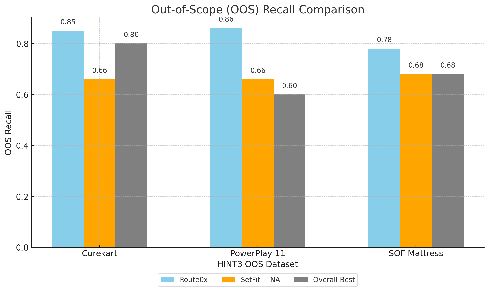<br/><br/>

**P50 Latency:** Numbers taken from the Amazon research paper but no hardware details were shared. Our latency numbers were ran on a Mac M1 Pro 16" machine, while we acknowledge it is not directly comparable (as the hardware details are missing) this gives a ballpark.

<br/><br/>

Caveat: Route0x uses SetFit as a base. But not as-is, we added a tweak on how we use it and a few more innovations on top of SetFit. (Jump to the sections below for more details). But unlike the SetFit + NA option suggested in the paper, We do not perturb positive samples to create hard negatives nor we used any special prompting or CoT for intent/OOS detection. We employ a straight forward Low-shot learning regime that only needs 2-samples from real dataset to simulate real world query routing users (who might find it hard to offer more samples for each route of interest). We augment those 2 sampls into to 12 effective samplesm, more on this later. Also we train only for 100 steps. The LLMs used in the paper as for as we can tell are hosted APIs hence by design suffers high latency due to network I/O and incurs $ which makes it infeasible for query routing which might touch many queries even if with uncertainity routing.

Note: All numbers are based on CPU, MPS/CUDA GPU device. Numbers can slightly vary based on the device and seeds. As the paper shows only the best numbers (without any notion of variations denoted usually with ±), we also show the best numbers in this comparison. 


### 2. [Route0x vs Salesforce Research 2022: CLINC OOS Dataset](https://arxiv.org/pdf/2106.04564)

[Datasets](https://huggingface.co/datasets/Salesforce/dialogstudio) 

**Goal of this comparison:** To show that Route0x offers robust in-scope accuracy in the presence of ID OOS and OOD OOS.

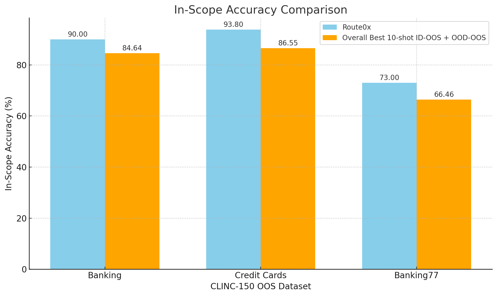<br/><br/>
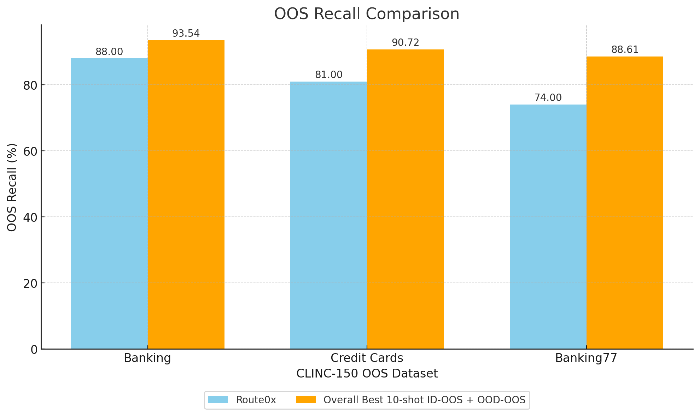<br/><br/>

Caveat: In this Route0x model is all-mpnet-base-v2 is compared against purpose-built architectures like TOD-BERT which are architected for and trained on TODS style intent detection. 

Note: All numbers are based on MPS GPU device. Numbers can slightly vary based on the device and seeds. As the paper shows the 
all numbers with uncertainity we present numbers from 3 runs and denote the variations with ±.


### 3. [Route0x vs Aurelio Labs' Semantic Router](https://github.com/aurelio-labs/semantic-router)

**Goal of this comparison:** To show that Route0x beats pure embedding similarity + threshold based approach for query routing.

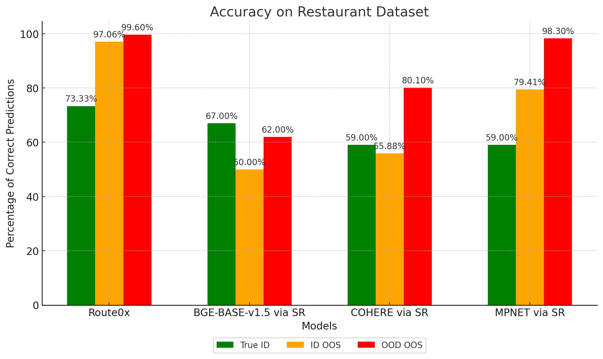<br/><br/>
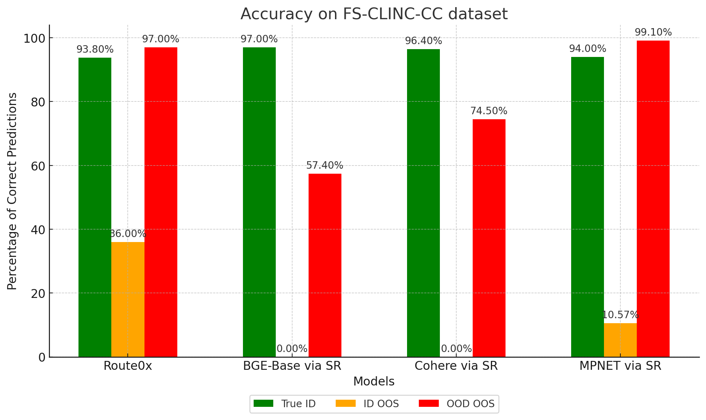<br/><br/>
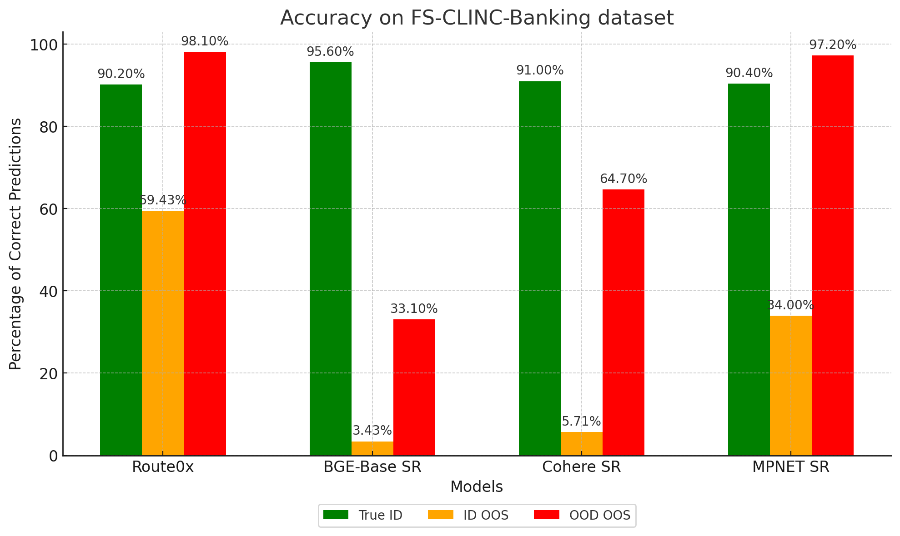<br/><br/>
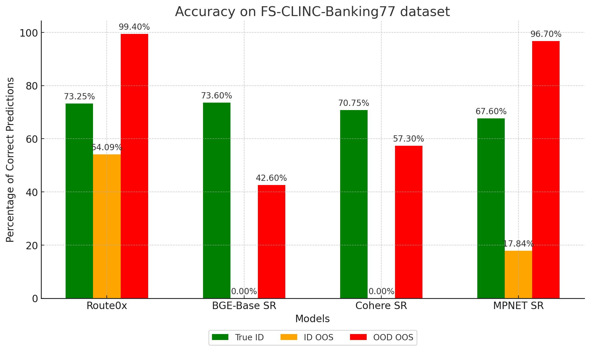<br/><br/>
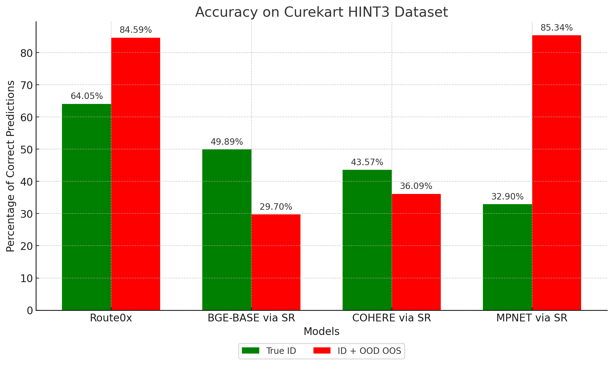<br/><br/>
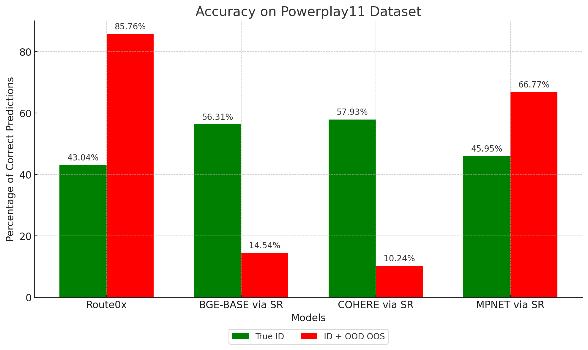<br/><br/>
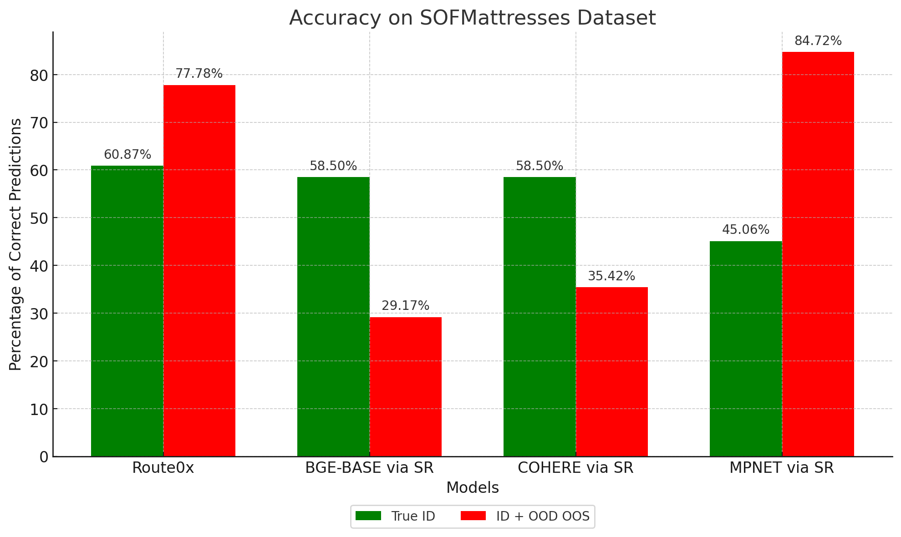<br/><br/>

### I want to know how it works
<details>
<br/><br/>

As the image suggests we have multiple heads to the same model a setfit model with 
default logistic regression head, a calibrated head, a LOF and IF head and a faiss index of NNs and a numpy compressed file of multi-vector representation of the NNs.
classifier heads will the first pass, LOF/IF heads help in OOS detection and NNs can help for classifier uncertainity, multi-vector representations help in reranking candidates. 

So when run `find_route`

```python
route_obj = query_router.find_route(query="How can we build an Alarm clock from scratch?")
```

route0x system combines all of its heads returns `route_obj`

```python

{
  'is_oos': True,                            # LOF / IF head output
 'query': 'How can we build an Alarm clock from scratch?',
 'route_id': 1,
 'route_name': 'NO_NODES_DETECTED',          # default label for OOS intents
 'prob': 0.56,                               # Model confidence
 'majority_voted_route': 'NO_NODES_DETECTED' # Majority voted NN
 'mean_distance_from_majority_route': 1.1501572
 }

```

default flow is controlled by `return_raw_scores`, when `False`. 


```python

route_obj = query_router.find_route(<your_query>, return_raw_scores= False)

if route['is_oos']:
    if prob < model_confidence_threshold_for_using_outlier_head:
        predicted_route = oos_label
else:
    if prob <= model_uncertainity_threshold_for_using_nn:
        predicted_route = route["majority_voted_route"]
```

**You can add your own fallback flow in 2 ways:**

a.) Add your own thresholds:

```python
query_router = RouteFinder(<your_route0x_model_path>, 
                          use_calibrated_head= True,
                          model_confidence_threshold_for_using_outlier_head = <your_value>,
                          model_uncertainity_threshold_for_using_nn= <your_value>
                          )
```                        

b.) Add your custom logic  set `return_raw_scores = True` and do post-hoc

How can you come up with sensible values for `model_confidence_threshold_for_using_outlier_head` and `model_uncertainity_threshold_for_using_nn` for your dataset/domain ?

We have added an experimental feature to offer a confidence_trend (confidence_trend.png in your route0x model folder), which can give a good idea as what should be these values.


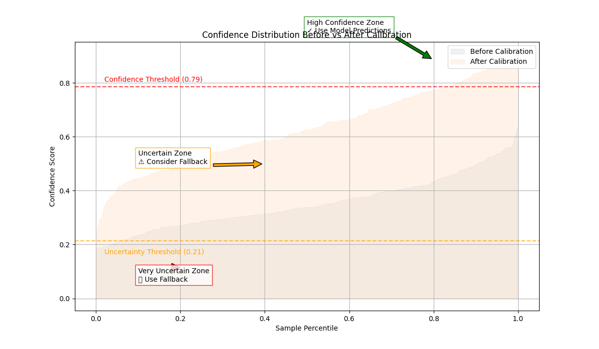<br/><br/>
</details>


### I want to understand the knobs and tinker with it:

<details>

Benchmarking is only researchers and not casual users.

#### Key knobs for building

```python
'loss_funct_name': 'PairwiseArcFaceFocalLoss',   # If you need Large Angular Margin + Scale between your routes.
'llm_name': 'llama3.1',   # You can use local or hosted LLMs, for hosted LLMs use provider given model names as-is
'min_samples': 12, # Recommended.
'samples_per_route': 30, # Recommended, may be try 50
'expected_oos_proportion': 0.1, # Unless you have extra domain knowledge on OOS / benchmarking use just 1% or 0.01
'nn_for_oos_detection': 10, # Unless you have extra domain knowledge on OOS / benchmarking just use 5
'model_name': 'sentence-transformers/all-mpnet-base-v2',# Recommended english use-cases.
'add_additional_invalid_routes': False, # enable to stop specific intents like chitchat/profanity 
"invalid_routes": ["gibberish", "mojibake", "chitchat", "non-english", "profanity"],
'instruct_llm': '' # To send additional instructions for better synthetic data gen.
```

#### Key knobs for routing

```python
  'use_calibrated_head': True, # Recommended, when benchmarking try turning it off.
  'return_raw_scores': False, # Recommended,  enable for custom fallback flow.
  'use_multivec_reranking': True, # Recommended, use it with  max_length = 64.
  'max_length': 64, # use_multivec_reranking =  False 24 is good.
  'model_confidence_threshold_for_using_outlier_head': 0.9, # Recommended, (How it works for more)
  'model_uncertainity_threshold_for_using_nn': 0.5, # Recommended, (How it works for more)
```


#### Full set of knobs for building

```python
{
  'train_path': None,
 'eval_path': None,
 'model_name': 'sentence-transformers/all-mpnet-base-v2',
 'epochs': 1,
 'max_steps': 100,
 'batch_size': 16,
 'output_dir': 'output',
 'seed': 1234,
 'lr': 2e-05,
 'loss_funct_name': 'PairwiseArcFaceFocalLoss',
 'warmup_proportion': 0.05,
 'min_samples': 12,
 'samples_per_route': 50,
 'routes': None,
 'route_template': '{}',
 'domain': 'personal assistant',
 'llm_name': 'llama3.1',
 'instruct_llm': '',
 'enable_id_oos_gen': True,
 'enable_synth_data_gen': True,
 'max_query_len': 24,
 'hf_dataset': None,
 'label_column': 'label',
 'text_column': 'text',
 'oos_label': 'NO_NODES_DETECTED',
 'add_additional_invalid_routes': False,
 'invalid_routes': ['gibberish',
  'mojibake',
  'chitchat',
  'non-english',
  'profanity'],
 'expected_oos_proportion': 0.1,
 'nn_for_oos_detection': 10,
 'skip_eval': False,
 'only_oos_head': False,
 'add_typo_robustness': False,
 'fallback_samples_per_route': 30,
 'device': 'cuda:0',
 'do_quantise': False,
 'local_llm_host': 'http://localhost:11434',
 'HOSTED_LLM_FAMILIES': {'openai': ['gpt'],
  'anthropic': ['claude'],
  'google': ['gemini']}
  }
```

#### Full set of knobs for routing

```python
  {
  'pooling_strategy': 'mean',
  'labels_dict': {},
  'metadata_dict':{},
  'multi_vec_embs': '/content/route0x_sof_model/token_embeddings.npz',
  'oos_label': 'NO_NODES_DETECTED',
  'max_length': 64,
  'model_confidence_threshold_for_using_outlier_head': 0.9,
  'model_uncertainity_threshold_for_using_nn': 0.5,
  'nn_for_fallback': 5
  }
```
</details>

### I want to see more usage samples
[Samples](./samples/README.md)

### I want to see the detailed numbers & reproduce benchmarks
[Benchmarks](./benchmarks/README.md)

### Features and Roadmap
<details>

- Integrate DSPy or AdalFlow for streamlining LLM prompt integrations (make sense ?).
- Run identify best non-english base model and test on few datasets (should be straight-jacket).
- Implement typo robustness for queries.
- Fill-in other LLM providers.
- **Experimental**
  - Identifying Confidence and Uncertainity thresholds to use fallback mechanism using Elbow/Knee locator.
  - Generating a test set quickly check the route0x outputs.
</details>

### Caveats and Limitations
<details>

- For Local LLMs tested only on llama3.x.
-  For hosted LLMs tested only on OAI GPT.x.

</details>

### Citations
<details>
- Will be added shortly
</details>